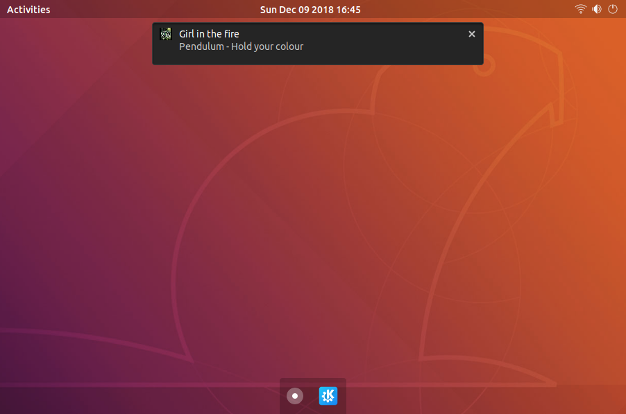

# Screenshots
Expect these to change often during development, but currently a dumb  version of Gnome shell renders (Dash to dock too)

# Goals
* Have a frontend where anyone can drop a theme (zip or css potentially) and it renders it entirely client side so you can preview the theme before using it
* Hopefully modularise this so other linux DE's are supported
* Be able to use this as a springboard to get React components that work out of the box with an imported GTK css file ([node-gtk-theme](https://github.com/jakejarrett/node-gtk-theme) / [electron-gtk-theme
](https://github.com/jaszhix/electron-gtk-theme))

# Why?
This allows developers and users quick access to previewing themes (You can just plop a css file in & ideally it will just live update the web preview to show you the theme)

# What works
* It renders a basic gnome shell for now
